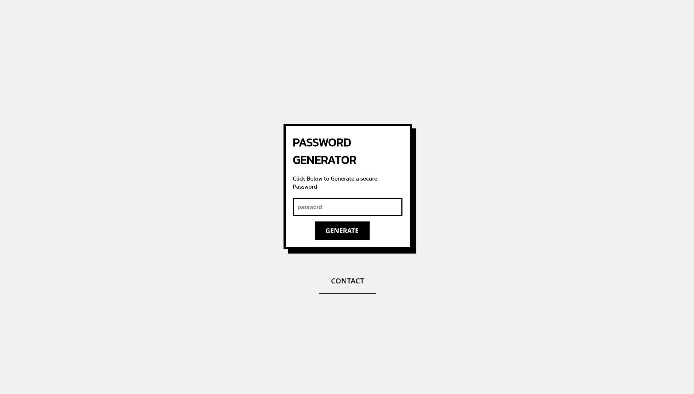

# 🔐 Password Generator App

A modern, minimal password generator web app built with **Python Flask**, **HTML/CSS**, and **inline JavaScript**. Secure, responsive, and fast — powered by Python’s `secrets` module for strong cryptographic randomness.

---

## 🌐 Features

- 🔒 Secure password generation using Python's `secrets` module  
- 🎨 Sleek retro interface using custom fonts and CSS  
- ⚡ Instant password generation without page reloads 

---

## 🚀 Demo

> ⚠️ Run locally to see it in action (see below).  
> Sample UI:

 

---

## 📦 Tech Stack

- **Backend:** Python 3, Flask  
- **Frontend:** HTML5, CSS3, JavaScript (vanilla, inline)  
- **Fonts:** [Kanit](https://fonts.google.com/specimen/Kanit) for UI, [FiraCode Nerd Font Mono](https://github.com/ryanoasis/nerd-fonts) for password display  
- **Security:** Python’s `secrets` module for cryptographically secure passwords

---

## 🛠️ Installation

```bash
git clone https://github.com/manas15khanna/password-generator.git
cd password-generator
pip install flask
python3 app.py 
```
